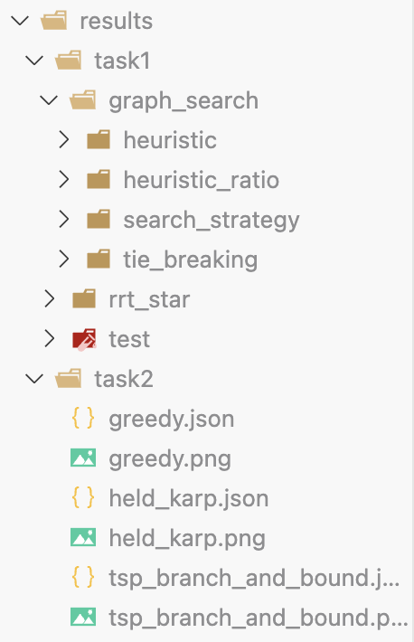

# ME5413 Homework 3

## Team Members

| Name          | Matric    |
| ------------- | --------- |
| Sima Kuankuan | A0284990M |
| Li Haowei     | A0285319W |
| Miao Yuchen   | A0285292W |

## Folder Structure

```
.
├── doc
├── map
├── package.xml
├── README.md
├── results # The experiment results of the tasks
│   ├── task1
│   └── task2
└── src # Source code for tasks 1 and 2
    ├── homework3.ipynb # Click-to-run code
    ├── homework3_original.ipynb
    ├── task1.py
    └── task2.py
```

## Features

Task 1:

- [x] Greedy best-first path planning
- [x] A\* path planning
- [x] Dijkstra's path planning
- [x] RRT and RRT\* path planning

Task 2:

- [x] Greedy search
- [x] Held-Karp algorithm (dynamic programming)
- [x] TSP branch and bound algorithm

## How to run

### For Tasks 1 and 2

```shell
pip install -r requirements.txt
```

In `src/homework3.ipynb`, you can directly run the corresponding code block for each task.

Because this assignment involves many comparison experiments, you may specify which experiment to run in the `main()` function by setting the corresponding `if` statement to `1`. For example, you can set `if 1:  # XXX single run` and set the following parameters to run the test experiment in Task 1:

```python
    # Settings need to be modified
    method = "graph_search"  # "graph_search" or "rrt"
    log_prefix = "test"
    rrt_params = {
        "map_resolution": MAP_RES,
        "max_iter": 10000,
        "step_size": 20,
        "search_radius": 30,
        "goal_tolerance_threshold": 50,
    }
    graph_search_params = {
        "map_resolution": MAP_RES,
        "heuristic": "analytic",  # analytic, euclidean, manhattan, chebyshev
        "heuristic_ratio": 1,  # 0.25,0.5,0.75,1
        "tie_breaking": True,
        "search_strategy": "astar",  # astar, dijkstra, greedy
    }
```

After running the code, the results will be saved in the `results` folder and organized by task name by default. A typical results folder structure is as follows:



### For task 3

The code for task 3 is origanized as a ROS package, see [this link](https://github.com/zyaqcl/ME5413_Planning_Project/tree/main) for more detail and runniing instructions.
